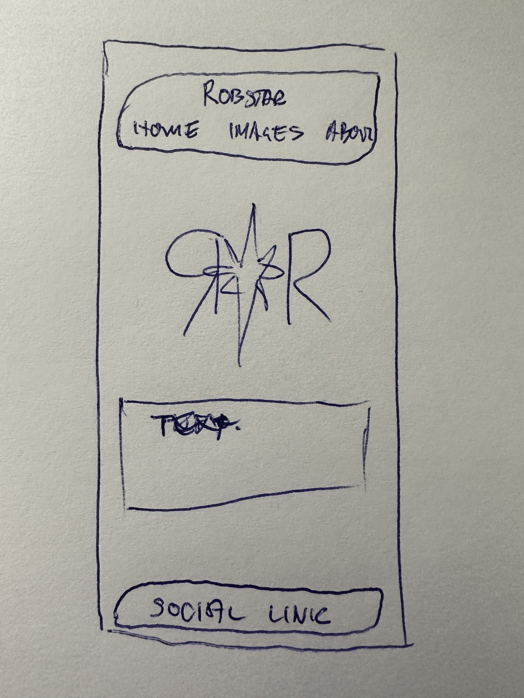
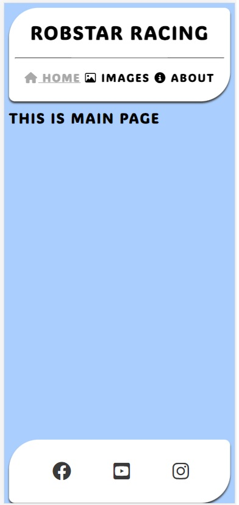
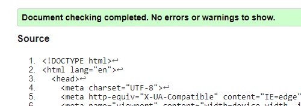

## Motocross & Enduro

This is README for my first Portfolio Project.

I will build a website that has some basic information about motorcross and enduro. What's the different. And me riding. The website will also contain a gallery with images related to the website's content.

The site will be developed with the concept of "mobile first" to be able to fit small screens and then be responsive for bigger screens.

The idea is to have one index.html and two sub pages. One with pictures and one with information about me as a rider and information about motocross and enduro riding.

The basic idea is to have it simple with some small 3d effects. 

## Features
---

Existing Features
Navigation Bar

Featured on all pages, the full responsive navigation bar should be centered with equal space between to follow the different sceen widths. Three links to Home, an image libaray and to an about page. This should look the same on all pages.
The navigation liks should always be visible to minimize the amount of clicking but also big enough to be able to use with a finger on a cell phone.
This section will allow the user to easily navigate from page to page across all devices without having to revert back to the previous page via the browser's ‘back’ button.

The first basic structure looks like this: 
 
This will be the main theme for all pages and will be added with contents.

## Testing
---
I first tested the code when the first structure was made. 
 
I got some info about "Trailing slash on void elements" but corrected it to get a nice ok.

You can safely delete this README.md file, or change it for your own project. Please do read it at least once, though! It contains some important information about Codeanywhere and the extensions we use. Some of this information has been updated since the video content was created. The last update to this file was: **July 26th, 2023**

## Codeanywhere Reminders

To run a frontend (HTML, CSS, Javascript only) application in Codeanywhere, in the terminal, type:

`python3 -m http.server`

A button should appear to click: _Open Preview_ or _Open Browser_.

To run a frontend (HTML, CSS, Javascript only) application in Codeanywhere with no-cache, you can use this alias for `python3 -m http.server`.

`http_server`

To run a backend Python file, type `python3 app.py`, if your Python file is named `app.py` of course.

A button should appear to click: _Open Preview_ or _Open Browser_.

In Codeanywhere you have superuser security privileges by default. Therefore you do not need to use the `sudo` (superuser do) command in the bash terminal in any of the lessons.

To log into the Heroku toolbelt CLI:

1. Log in to your Heroku account and go to _Account Settings_ in the menu under your avatar.
2. Scroll down to the _API Key_ and click _Reveal_
3. Copy the key
4. In Codeanywhere, from the terminal, run `heroku_config`
5. Paste in your API key when asked

You can now use the `heroku` CLI program - try running `heroku apps` to confirm it works. This API key is unique and private to you so do not share it. If you accidentally make it public then you can create a new one with _Regenerate API Key_.

---

Happy coding!
