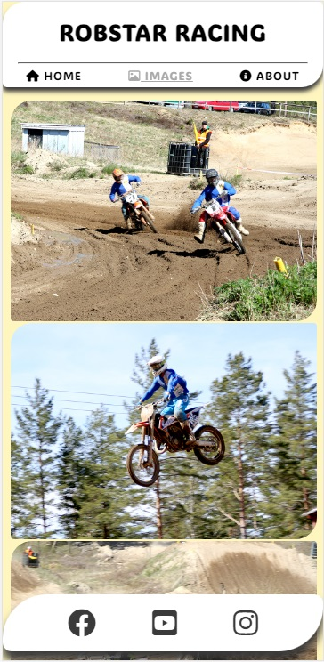
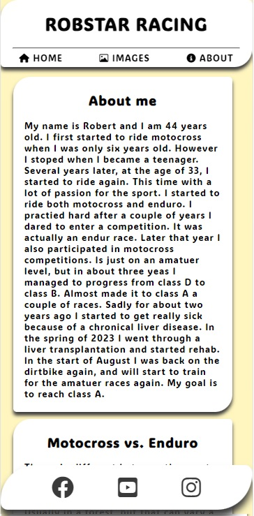

## Robstar Racing - Motocross & Enduro

This is README for my first Portfolio Project.

Project one is to show what I have learn during the first HTML and CSS course. I will build a website that has some basic information about motorcross and enduro. What's the different. And me riding. The website will also contain a gallery with images related to the website's content.

The site will be developed with the concept of "mobile first" to be able to fit small screens and then be responsive for bigger screens.

The idea is to have one index.html and two sub pages. One with pictures and one with information about me as a rider and information about motocross and enduro riding.

The basic idea is to have it simple with some small 3d effects. 

## Features
---

Existing Features
Navigation Bar

Featured on all pages, the full responsive navigation bar should be centered with equal space between to follow the different sceen widths. Three links to Home, an image libaray and to an about page. This should look the same on all pages.
The navigation links should always be visible to minimize the amount of clicking but also big enough to be able to use with a finger on a cell phone.
This section will allow the user to easily navigate from page to page across all devices without having to revert back to the previous page via the browser's ‘back’ button.

The first basic structure looks like this: 
 
This will be the main theme for all pages and will be added with contents.

I wanted my logo as a hero image: 
 
Something eye catching on the page to make the visitor interested. The logo is hopefylly cool enough for this purpose.
I made sure it has the width of 1920 pixels to cover most of the screens.

I really liked the idea of the footer from the Love Runing project. So I used that knowledge from that and made it fit my design. 
 
This will ensure that the visitor can find other media quick and easy if they wish to get more information or wants to follow me in any social media.
I made the links work to my Facebook page, YouTube and Instagram. I made them open in new windows. But beware, the pages are in Swedish.

Also the gallery idea from the Love running project was a nice feature. Especially the feature that made the image sort up in more columns 
the wider the screen gets. This gives a great view over the images and works good on any screen with.

In the about page I wanted the visitor to be able to read some about me and what's the different between motocross and enduro. 
I can write a lot about but I think the content is enough for now.

## Finalising
---
Finally after some time I started to feel satisfied with a good site: 
 
This is the view from a Samsung Galaxy S8+, but I've been working a lot with different sceeen sizes and in responsive mode to confirm that it will work on 
all devices.

## More features?
---
Of course I want to add more things.
<ul>
<li> One image gallery so it will be one for motocross and one for enduro.</li>
<li> Thinking of adding a video on the index page.</li>
</ul>

## Testing
---
I first tested the code when the first structure was made. 
 
I got some info about "Trailing slash on void elements" but corrected it to get a nice ok.

When I felt that I was starting to be done. I tested all the code again.
All the info about "Trailing slash on void elements" was back. And I noticed that Codeanywhere add this automatically. So this time I decided just to filter that so it doesn't show everytime.
But I got some warnings that I should add headers. Which I did with a class to hide it.

The CSS Validator gave me two errors. One that I had forgot to write a unit on a margin. And the second one was that I had typed "position; bottom;" 
which I changed to "position; fixed;".

Links to the validation
<ul>
<li> HTML of <a href="https://validator.w3.org/nu/?doc=https%3A%2F%2Frobertahlin.github.io%2Fmotocross-in-action%2Findex.html" target="_blank">index</a> page.</li>
<li> HTML of <a href="https://validator.w3.org/nu/?doc=https%3A%2F%2Frobertahlin.github.io%2Fmotocross-in-action%2Fimages.html" target="_blank">images</a> page.</li>
<li> HTML of <a href="https://validator.w3.org/nu/?doc=https%3A%2F%2Frobertahlin.github.io%2Fmotocross-in-action%2Fabout.html" target="_blank">about</a> page.</li>
<li> CSS of <a href="https://jigsaw.w3.org/css-validator/validator?uri=https%3A%2F%2Frobertahlin.github.io%2Fmotocross-in-action%2Fassets%2Fcss%2Fstyle.css&profile=css3svg&usermedium=all&warning=1&vextwarning=&lang=en" target="_blank">style.css</a>.</li>
</ul>

### Bugs?
Yes, Wen using different screen sizes and espicially the responsive view in the browser. The "header", "main" and "footer" section doesn't line to the right margin of the view. It looks good on a mobile, but the wider screen is, the worse it looks. I have tried with various widths, margins and paddings without success. I tried to search the internet without any help. The last thing I noticed was that it seems to be affected by the "z-index" value. The higher value the more close it is to the right edge. Couln't solve it or even if might not be able to solve? Is that the purpose of "z-index"?

## Deployment
---
<ul>
<li>The site was deployed to GitHub pages. The steps to deploy are as follows:</li>
<ul>
<li>In the GitHub repository, navigate to the Settings tab</li>
<li>From the source section drop-down menu, select the Master Branch</li>
<li>Once the master branch has been selected, the page will be automatically refreshed with a detailed ribbon display to indicate the successful deployment.</li>
</ul>
</ul>
The live link can be found here - <a href="https://robertahlin.github.io/motocross-in-action/" target="_blank">https://robertahlin.github.io/motocross-in-action/</a>

## Credits
---
As you probably can see, I have got a lot of insiration from the Love Running project. Hence that was a good walkthroug project and gave me a ton of knowledge.

Other that that:
All the text are authored by me.
All the pictures are taken by me or my fiancé.
The hero logo is done by me.